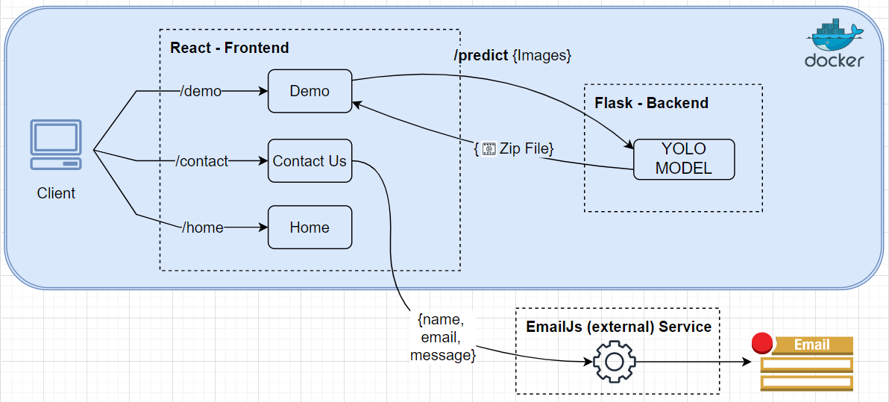

# Airborne-Object-Sense-Avoid

Airborne object sense &amp; avoid, project that uses a machine learning model to infer images to detect airborne objects, which would then be classified and tracked to predict a manoeuvre that avoids the obstacles

## Abstract

&nbsp;&nbsp;&nbsp;&nbsp;&nbsp;&nbsp;&nbsp;&nbsp;&nbsp;&nbsp;&nbsp;&nbsp;&nbsp;&nbsp;Over the past few years, Unmanned Aerial Vehicles (UAVs), like drones, have risen in
popularity. Drones have become vital to the functions of many businesses, with the market
expected to grow to $64 billion by 2025. Companies like Amazon take advantage of this
opportunity by swiftly incorporating autonomous drone flights to deliver packages. While the
route an autonomous drone takes can be carefully planned ahead of its mission, there
remains a chance that the drone will encounter unforeseen airborne objects. Therefore, it has
become vital that drones develop sense and avoidance capabilities to help evade these
obstacles. A safety-critical system like this one can help reduce crashes and improve public
safety. In this project, I will design and develop a web application that intends to showcase
the model's accuracy and performance. The solution aims to develop convolutional neural
networks that can analyse images and detect airborne objects. The detected object will then
be classified and tracked to predict a manoeuvre that creates a safer route. Existing solutions
have been able to perform object detection using expensive sensors: ultrasonic, lasers,
infrared, increasing the overall drone’s weight and hurting its battery life. Solving the
problem by re-using the drone’s onboard cameras is an attractive solution. A model was
designed, developed and trained on the Airborne Object Tracking (AOT) dataset. The project
has been rigorously statistically evaluated on the model’s accuracy and performance. Lastly,
the model got integrated into a web application and tested on its functionality. In conclusion,
it performed sense & avoidance on most airborne objects classes; however, the model’s
inference time can be improved to offer real-time response.

## Aims and Objectives

The project aims to create a machine learning model that can infer images to detect airborne
objects, which would then be classified and tracked to predict a manoeuvre that avoids the
obstacles. The project’s goals would be achieved by completing the following objectives:

1. Conduct research to find literature on existing drone sense & avoidance systems and
machine learning algorithms to build the basis for this project.
2. Research potential methodologies to use and create a plan based on the methodology
that, when followed, obtains project goals.
3. Source publicly available datasets on airborne objects and gain approval by Brunel
research ethics online (BREO) where necessary.
4. Design, train and implement a machine learning inference model that fulfils the project’s
aim.
5. Design and create an interface to allow users to interact and test its interface on
functionality.
6. Evaluate the model's performance against evaluation metrics (such as detection
accuracy, rate of false positives and overall classification accuracy).
7. Evaluate the project on what went well, what could be improved and potential future
works.

## Install

[Python>=3.6.0](https://www.python.org/) 
is required with all 
[requirements.txt](https://github.com/Goswami-Pratik/Airborne-Object-Sense-Avoid/root/back-end/requirements.txt)
installed including [PyTorch>=1.7](https://pytorch.org/get-started/locally/):

```
$ git clone https://github.com/Goswami-Pratik/Airborne-Object-Sense-Avoid.git
$ cd Airborne-Object-Sense-Avoid\root\back-end
$ pip install -r requirements.txt
```

### Docker Commands

* Note: Change LOCAL_FOLDER directory

```
$ docker build -t AirborneSenseAvoid:latest .
$ docker run --privileged=true --rm -it -v LOCAL_FOLDER:/workspace/UPLOAD_FOLDER -p 5000:5000 AirborneSenseAvoid
```

## Environments & Technologies

<p align="center">
  
</p>

## Screenshots

### Live Predictions & Tracking

<p align="center">
  
</p>

### Home Page


### Demo Page


### Contact Us Page


### Architecture



### Dataset Pipeline


## [License](https://opensource.org/licenses/MIT)

By contributing, you agree that your contributions will be licensed under the MIT license.
